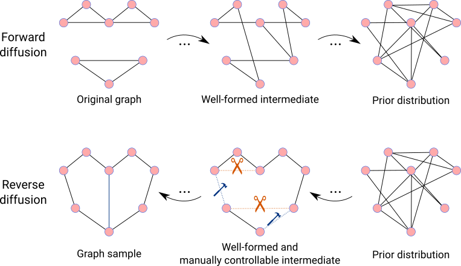

# GraphGUIDE: interpretable and controllable conditional graph generation with discrete Bernoulli diffusion

<p align="center">
    
</p>

### Introduction

Diffusion models achieve state-of-the art performance in generating realistic objects, with the most useful and impactful work in diffusion being on _conditional_ generation, where objects of certain specific properties are generated.

Unfortunately, it has remained difficult to perform conditional generation on graphs, particularly due to the discrete nature of graphs and the large number of possible structural properties which could be desired in any given generation task.

This repository implements GraphGUIDE, a framework for graph generation using diffusion models, where edges in the graph are flipped or set at each discrete time step. GraphGUIDE enables full control over the conditional generation of arbitrary structural properties without relying on predefined labels. This framework for graph diffusion allows for the interpretable conditional generation of graphs, including the generation of drug-like molecules with desired properties in a way which is informed by experimental evidence.

See the [corresponding paper](https://arxiv.org/abs/2302.03790) for more information.

This repository houses all of the code used to generate the results for the paper, including code that processes data, trains models, implements GraphGUIDE, and generates all figures in the paper.

### Citing this work

If you found GraphGUIDE to be helpful for your work, please cite the following:

Tseng, A.M., Diamant, N., Biancalani, T., Scalia, G. GraphGUIDE: interpretable and controllable conditional graph generation with discrete Bernoulli diffusion. arXiv (2023) [Link](https://arxiv.org/abs/2302.03790)

[\[BibTeX\]](references/bibtex.bib)

### Description of files and directories

```
├── Makefile    <- Installation of dependencies
├── data    <- Contains data for training and downstream analysis
│   ├── raw    <- Raw data, directly downloaded from the source
│   ├── interim    <- Intermediate data mid-processing
│   ├── processed    <- Processed data ready for training or analysis
│   └── README.md    <- Description of data
├── models
│   └── trained_models    <- Trained models
├── notebooks    <- Jupyter notebooks that explore data, plot results, and analyze results
│   └── figures    <- Jupyter notebooks that create figures
├── results    <- Saved results
├── README.md    <- This file
└── src    <- Source code
    ├── feature    <- Code for data loading and featurization
    ├── model    <- Code for model architectures and training
    ├── analysis    <- Code for analyzing results
    └── plot    <- Code for plotting and visualization
```
